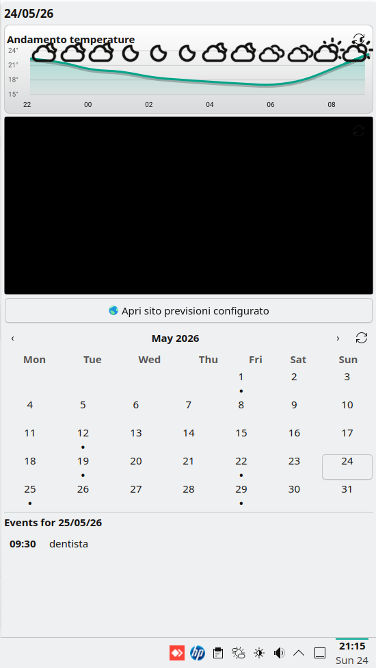
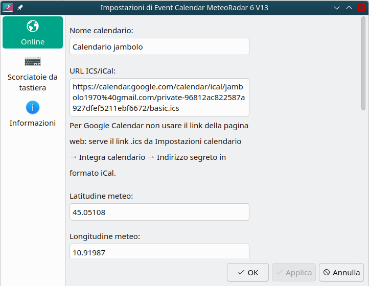
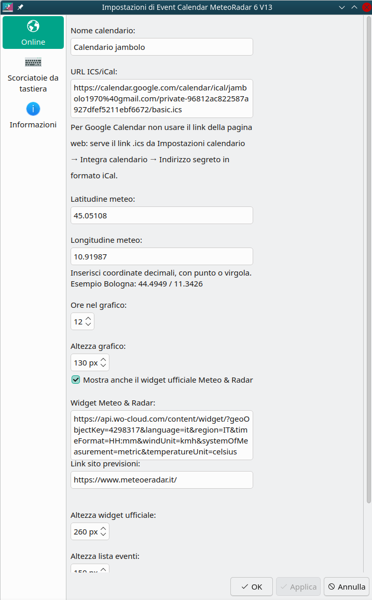

# Event Calendar MeteoRadar 6

Plasmoid per **KDE Plasma 6** con calendario online iCal/ICS, previsione meteo oraria e widget ufficiale **Meteo & Radar** integrato.



## Funzioni

- Calendario mensile per Plasma 6
- Eventi da calendario online in formato `.ics` / iCal
- Compatibile con Google Calendar tramite indirizzo segreto iCal
- Meteogramma con andamento temperature su più ore
- Icone meteo stile Event Calendar originale
- Widget ufficiale Meteo & Radar incorporato
- Configurazione di latitudine, longitudine, link widget e link pagina previsioni
- Area eventi con scorrimento

## Installazione semplice da interfaccia KDE

Scaricare il file `.plasmoid` dalla sezione **Releases**.

Poi:

1. tasto destro sulla barra o sul desktop
2. **Aggiungi oggetti**
3. **Installa da file locale...**
4. selezionare `eventcalendar-meteoradar6-v13.plasmoid`
5. aggiungere il plasmoid alla barra o al desktop

## Installazione da terminale

Non serve compilare: il plasmoid è QML/JavaScript e viene installato come pacchetto Plasma.

```bash
plasmapkg2 --install packages/eventcalendar-meteoradar6-v13.plasmoid
```

Per reinstallare dopo modifiche:

```bash
plasmapkg2 --remove org.kde.plasma.eventcalendar.meteoradar6v13
plasmapkg2 --install packages/eventcalendar-meteoradar6-v13.plasmoid
```

Installazione manuale, valida per qualsiasi utente:

```bash
mkdir -p ~/.local/share/plasma/plasmoids
cp -r org.kde.plasma.eventcalendar.meteoradar6v13 ~/.local/share/plasma/plasmoids/
```

Poi riavviare Plasma, oppure uscire e rientrare nella sessione.

## Pacchettizzazione da sorgente

Da dentro la cartella del progetto:

```bash
./scripts/package.sh
```

Il file verrà creato in:

```text
packages/eventcalendar-meteoradar6-v13.plasmoid
```

## Configurazione Google Calendar

Non usare il link della pagina web di Google Calendar.
Serve un link `.ics`.

In Google Calendar:

1. aprire le impostazioni del calendario
2. andare in **Integra calendario**
3. copiare **Indirizzo segreto in formato iCal**
4. incollarlo nel campo `URL ICS/iCal`

Il link di solito somiglia a:

```text
https://calendar.google.com/calendar/ical/.../basic.ics
```

## Configurazione Meteo & Radar

Nel pannello di configurazione si possono impostare:

- latitudine
- longitudine
- URL del widget Meteo & Radar
- URL della pagina previsioni
- altezza del widget ufficiale
- ore mostrate nel grafico
- altezza lista eventi





## Dipendenze

- KDE Plasma 6
- Qt/QML standard di Plasma
- Qt WebEngine / WebView disponibile nel sistema, necessario per il widget Meteo & Radar incorporato

Su alcune distribuzioni il pacchetto può chiamarsi in modo simile a:

```text
qt6-webengine
qml6-module-qtwebengine
```

Il nome esatto dipende dalla distribuzione.

## Struttura progetto

```text
org.kde.plasma.eventcalendar.meteoradar6v13/   sorgente plasmoid
packages/                                      pacchetto .plasmoid pronto
screenshots/                                   immagini per README e release
assets/                                        icona progetto
scripts/package.sh                             script per creare il .plasmoid
```

## Licenza ℹ️

GPLv3 o successiva. Vedi `LICENSE`.
